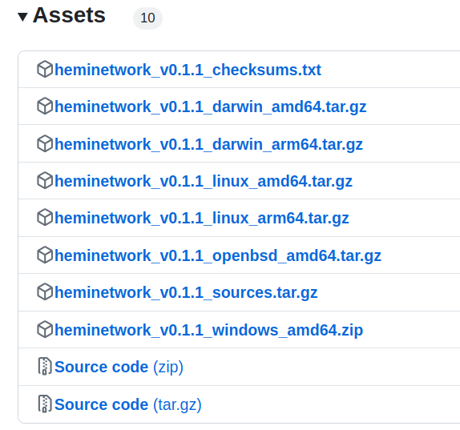

# Setup: Part 1


## 📜 **TL;DR:**

* This guide provides straightforward steps to download, set up, and run your PoP Miner, either by downloading pre-built binaries or by building from source.
* Ensure you have your development environment ready and follow the steps below to join the mining network.


***

## 🏁 Prerequisites

1. Basic CLI Knowledge

***

## 📚 Tutorial

### 1. Binaries

* Download a pre-built binary or[ build from source using the README](https://github.com/hemilabs/heminetwork/releases).
* View `Assets`
  *

      
  * The files are named as `heminetwork_v0.1.1_<os>_<arch>.tar.gz` for Mac/Linux and `heminetwork_v0.1.1_windows_amd64.zip` for Windows.
* After downloading the necessary files, you must extract them from their compressed format before you can use or access the software.
  * For `.tar.gz` **files on Mac/Linux, use the `tar`** command in the Terminal
  * For `.zip` files on Windows, use the built-in extraction tool by right-clicking on the file and choosing `Extract All`


Use the `uname -a`command in the CLI to view all system information, ensuring compatibility with the correct asset on GitHub.


***

### 2. Open the folder

* List the files

```none
ls
```

Your output should be:

*   #### Linux & macOS

    ```none
    bfgd    bssd    extool    hemictl    keygen    popmd    tbcd
    ```
*   #### For Windows

    ```none
    bfgd.exe    bssd.exe    extool.exe     hemictl.exe     keygen.exe     popmd.exe     tbcd.exe
    ```

***

### 3. Verify Configuration Success

To ensure the setup is correctly configured, execute the command below:

```none
./popmd --help
```

This will display the help menu for `popmd`, indicating that it's installed and operational.

```none
Hemi Proof of Proof miner: v0.1.1-pre+29f116fb4
Usage:
        help (this help)
Environment:
        POPM_BFG_URL           : url for BFG (Bitcoin Finality Governor) (default: http://localhost:8383/v1/ws/public)
        POPM_BTC_CHAIN_NAME    : the name of the bitcoing chain to connect to (ex. "mainnet", "testnet3") (default: testnet3)
        POPM_BTC_PRIVKEY       : bitcoin private key (required) 
        POPM_LOG_LEVEL         : loglevel for various packages; INFO, DEBUG and TRACE (default: popmd=INFO;popm=INFO)
        POPM_PPROF_ADDRESS     : address and port popm pprof listens on (open <address>/debug/pprof to see available profiles)
        POPM_PROMETHEUS_ADDRESS: address and port bssd prometheus listens on 
        POPM_REMINE_THRESHOLD  : the number of L2 Keystones behind the latest seen that we are willing to remine, this is handy for re-orgs (default: 0)
        POPM_STATIC_FEE        : specify the number of sats/vB the PoP Miner will pay for fees (default: 1)

```

***

### 4. Generate Your Public Key

Start by generating your public key, your identifier on the Hemi Network.

<table data-card-size="large" data-view="cards"><thead><tr><th></th><th></th><th></th></tr></thead><tbody><tr><td><h4>Linux &#x26; macOS</h4></td><td><p></p><p><mark style="color:purple;">⚠️ On Mac you will need to remove the quarantine by running:</mark></p><p><mark style="color:purple;"><code>xattr -d com.apple.quarantine ./keygen</code></mark></p></td><td><p></p><p><strong>Run the following command:</strong> </p><pre data-overflow="wrap"><code>./keygen -secp256k1 -json -net="testnet" > ~/popm-address.json
</code></pre></td></tr><tr><td><h4>For Windows</h4></td><td><p><mark style="color:purple;">⚠️ <strong>Important Note for Windows Users</strong>: To successfully execute this command, you must use the Command Prompt, not PowerShell (which is the default terminal in environments like Visual Studio Code). Follow these steps to open Command Prompt:</mark></p><ol><li><mark style="color:purple;">Click on the <strong>Start Menu</strong> button or press the <strong>Windows</strong> key on your keyboard.</mark></li><li><mark style="color:purple;">Type <strong><code>cmd</code></strong></mark> <mark style="color:purple;">into the search bar and open it.</mark></li></ol></td><td><ol><li><p>Type the following command and press Enter:</p><pre class="language-cmd" data-overflow="wrap"><code class="lang-cmd">keygen.exe -secp256k1 -json -net="testnet" > %HOMEDRIVE%%HOMEPATH%\popm-address.json
</code></pre></li></ol><p><strong>Note:</strong> After running the command, you might not see any immediate feedback in the Command Prompt. This is expected behavior.</p><p></p><ol start="2"><li>Open the Generated Key File</li></ol><p>After generating the key file, you'll want to check its contents. To do this, use the following command in Command Prompt:</p><pre class="language-cmd" data-overflow="wrap"><code class="lang-cmd">%HOMEDRIVE%%HOMEPATH%\popm-address.json
</code></pre><p>This command opens the <code>popm-address.json</code> file in Notepad, allowing you to view or edit the generated key.</p></td></tr></tbody></table>


***

### 5. Open the JSON

```none
cat ~/popm-address.json
```

You should get an example result like:

```none
{
  "ethereum_address": "0x12345FabcD298299b8250e16eEb7D6a7B81DfEdC",
  "network": "testnet",
  "private_key": "123456789abcdef123456789abcdef123456789abcdef123456789abcdef1234",
  "public_key": "04123456789abcdef123456789abcdef123456789abcdef123456789abcdef12345678abcdef123456789abcdef123456789abcdef123456789abcdef1234",
  "pubkey_hash": "m12345678P2xVWwVCWxq7tHJLGcJz2h6XYZ"
}
```


#### Glossary

* `ethereum_address`: This is the unique identifier to which you can send Ethereum-based funds, including those on mainnets, testnets (like Sepolia), and Layer 2 networks (like Hemi). It facilitates cross-environment transactions, meaning the same address is applicable across different Ethereum networks.
* `network`: Refers to the specific blockchain environment (e.g., Ethereum mainnet, Sepolia testnet, or a Layer 2 solution) that a transaction or operation is intended for.
* `private_key`: A secure digital code known only to the owner, used to access and manage the corresponding Ethereum address in wallets like MetaMask. It’s essential for interacting with blockchain networks, allowing the execution of transactions from the Ethereum address.
* `public_key`: Derived from the private key, this is shared publicly and used in the encryption process. For the Hemi network, it's intended for future use to whitelist addresses with the Bitcoin Finality Governor (BFG) endpoint.
* `pubkey_hash`: Represents a Bitcoin address generated from the private\_key, which the PoP Miner application can use. It's recommended not to try importing this address into a wallet, as it's specifically for mining activities.


***

### 7. [Setup Part 2](setup-part-2.md)
